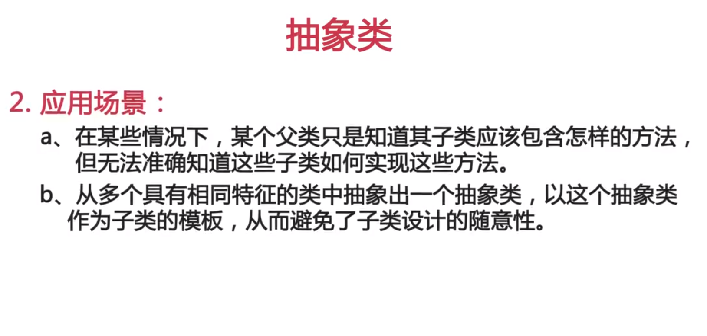

[TOC]
# Linux

## 安装Ubuntu系统

## 清理Ubuntu

## 更换更新源

~~~
# deb cdrom:[Ubuntu 16.04 LTS _Xenial Xerus_ - Release amd64 (20160420.1)]/ xenial main restricted
deb http://mirrors.tuna.tsinghua.edu.cn/ubuntu/ xenial main restricted
deb http://mirrors.tuna.tsinghua.edu.cn/ubuntu/ xenial-updates main restricted
deb http://mirrors.tuna.tsinghua.edu.cn/ubuntu/ xenial universe
deb http://mirrors.tuna.tsinghua.edu.cn/ubuntu/ xenial-updates universe
deb http://mirrors.tuna.tsinghua.edu.cn/ubuntu/ xenial multiverse
deb http://mirrors.tuna.tsinghua.edu.cn/ubuntu/ xenial-updates multiverse
deb http://mirrors.tuna.tsinghua.edu.cn/ubuntu/ xenial-backports main restricted universe multiverse
deb http://mirrors.tuna.tsinghua.edu.cn/ubuntu/ xenial-security main restricted
deb http://mirrors.tuna.tsinghua.edu.cn/ubuntu/ xenial-security universe
deb http://mirrors.tuna.tsinghua.edu.cn/ubuntu/ xenial-security multiverse
~~~
## ssh服务

* 更改默认端口

## iptables

# Mysql

## 常用操作
* 创建数据库
* 创建数据表
* PHP连接数据库
* Java连接数据库
* 分表

## 索引
## 分表

# PHP

## wamp
~~~
1.安装wamp的时候,有时会提示  因为计算机丢失了MSVCR110.dll
因为现在所有的 5.5 环境都是基于 vc11 的编译脚本下生成的，所以在 windows 下你得安装相关组件。
解决办法:  微软官方下载 软件 安装后就可以了

2.   Wamp修改MySQL 默认密码
use mysql;
update user set password=PASSWORD('hooray') where user='root';
flush privileges;
然后在phpmyadmin 文件夹下修改config.inc.php
$cfg['Servers'][$i]['user'] = 'root';
$cfg['Servers'][$i]['password'] = '111';
11-03
Windows 下php memcache扩展的开启  wamp安装包
extension=php_memcache.dll  要写在apache目录下的php.ini 
开启apache虚拟主机
# Virtual hosts
Include conf/extra/httpd-vhosts.conf
然后在httpd-vhosts.conf
设置
<VirtualHost *:80>
        DocumentRoot C:/wamp/www
        ServerName localhost
        <Directory "C:/wamp/www">
            Options Indexes FollowSymLinks
            AllowOverride All
            Order allow,deny
            Allow from all
        </Directory>
  </VirtualHost>
这样在浏览器输入localhost也能打开了.
Apache 开启虚拟目录
例如在C盘的根目录之下的workplace 设置为一个虚拟目录
1.  # Virtual hosts
Include conf/extra/httpd-vhosts.conf
//首先允许使用虚拟目录的配置文件
为了 可以打开localhost 需要在Apache的虚拟目录配置文件httpd-vhosts.conf下加入这一段
 
<VirtualHost *:80>
        DocumentRoot C:/wamp/www
        ServerName localhost
        <Directory "C:/wamp/www">
            Options Indexes FollowSymLinks
            AllowOverride All
            Order allow,deny
            Allow from all
        </Directory>
  </VirtualHost>
2. 在Apache的httpd.conf 文件下加入
<Directory "c:/workplace/">
Options Indexes FollowSymLinks

AllowOverride all
Require local
</Directory>

11-02
Php解析更改
如果想要在View文件中使用<?=someVariable?>代替<?php echo $value ?>的功能，需要在php.ini中开启short opentag, short_open_tag = On才可，否则<?=?>的表达式不能被正常解析。

~~~

* Wmap 更改MySQL密码
1.打开mysql控制台 use mysql  
2.update user set password=PASSWORD('hooray') where user='root';
3.flush privileges;
4.quit
此时打开

$cfg['Servers'][$i]['user'] = 'root';
$cfg['Servers'][$i]['password'] = '111';

* 配置虚拟主机
~~~

~~~

## openssl组件的使用

## Yii框架
### 路由
### 数据库

# Nginx

## 重写规则
## 负载均衡

## 图片裁剪

# virtualBox
## Ubuntu server 挂载文件夹
~~~
Folders” in VirtualBox, the user should install VirtualBox guest additions:

(1) Select Devices -> Insert
Guest Additions CD image. If the VirtualBox prompts:

Unable to insert the virtual optical disk C:\Program Files\Oracle\VirtualBox\VBoxGuestAdditions.iso into the machine CentOS. Would you like to try to force insertion of this disk? Count not mount the media/drive 'C:\Program Files\Oracle\VirtualBox\VBoxGuestAdditions.iso' (VERR_PDM_MEDIA_LOCKED).
It means the Devices -> CD/DVD
DEvices already has ISO file. Please inject it, and try Insert
Guest Additions CD image again.

(2) Mount the ISO file:

mount /dev/cdrom /mnt
(3) Install the VirtualBox guest additions (Take Linux as an example):

cd /mnt ./VBoxLinuxAdditions.run
You may also need to install bzip2, gcc and kernel files to install guest additions successfully. When meeting errors, please refer /var/log/vboxadd-install.log for detail info.
~~~

挂载命令

# docker

## 安装docker

## 配置加速器

## docker私有仓库 docker Registry
[官方文档](https://docs.docker.com/registry/)
* [参考](http://blog.csdn.net/felix_yujing/article/details/51564739)
## docker 网络
## docker 安装mysql
~~~
docker run -d --name mysql -p 3306:3306  -e MYSQL_ROOT_PASSWORD=1234567 daocloud.io/library/mysql:5.7.7 
docker run -d --name mysql  --restart always -p 3306:3306  -e MYSQL_ROOT_PASSWORD=1234567 mysql:latest
~~~
## docker 安装redis

## docker 安装nginx

## docker搭建PHP开发环境

## docker 安装gitlab
~~~
mkdir -p srv/gitlab/config && mkdir -p srv/gitlab/logs && mkdir -p srv/gitlab/data

sudo docker run --detach --hostname mygitlab.com --env GITLAB_OMNIBUS_CONFIG="external_url 'http://192.168.1.12/'; gitlab_rails['lfs_enabled'] = true;" --publish 443:443 --publish 80:80 --publish 22:22 --name gitlab  --restart always --volume /home/hdb/software/gitlab/srv/gitlab/config:/etc/gitlab --volume /home/hdb/software/gitlab/srv/gitlab/logs:/var/log/gitlab --volume /home/hdb/software/gitlab/srv/gitlab/data:/var/opt/gitlab gitlab/gitlab-ce:latest

密码 heiha798
~~~

## docker-composer

# Javascrit

# Java 
[java8官方文档](https://docs.oracle.com/javase/8/docs/)
* 安装java

## windows10安装
~~~
CLASSPATH=.;C:\Program Files\Java\jdk1.8.0_171\lib\dt.jar;C:\Program Files\Java\jdk1.8.0_171\lib\tools.jar
PATH=C:\Program Files\Java\jdk1.8.0_171\bin;C:\Program Files\Java\jdk1.8.0_171\jre\bin
~~~
## 语法
* 多态中的类型转换
* 抽象类

# go 

## go安装

在/etc/profile 加入 
export GOROOT=/home/hdb/software/go
export PATH=$PATH:$GOROOT/bin
这样重启后也会生效

# redis

# git

* 设置用户名和邮箱
git config --global user.name "test"
git config --global user.email "test@live.com"

* 生成ssh-key
~~~
ssh-keygen -t rsa -C "test@live.com"
~~~

* 忽略文件
.gitignore

# http协议

# TCP/IP协议

# 各种软件
## fiddler
* 手机抓包 

# 杂项
## 工具
### vs code 
* 关闭自动更新

####  扩展

#### 快捷键

#### 使用技巧

### phpstorm
### idea

## markdown简历